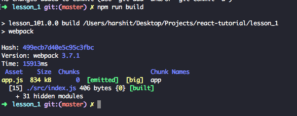

# Lesson 1

## Where to start?

We'll start with coding right away and come back to understand setup later.

Run the following commands before starting:
```cmd
npm install
npm run build
```

Your output should look similar to the below screenshot:



Now open index.html in the browser

You should see a hello world example running.

## Understanding React Components

### What is a React Component?
According to the official react site 
:

Components let you split the UI into independent, reusable pieces, and think about each piece in isolation. 


How do you define a React Component?
   
   You can define a component by extending the React.Component class.

Example:
```jsx
import React, { Component } from 'react';

class ExampleComponent extends Component {
    render() {
        return <h1>Hey, this is an example component</h1>;
    }
}
```

Noticed anything different about the above snippet of code?

The above code is written in JSX Syntax. While you can write React without JSX syntax, JSX makes it elagant.


Understanding Component Life Cycle:

Each component has several “lifecycle methods” that you can override to run code at particular times in the process. They can be categorized as below:


Mounting:
```javascript
    constructor() 
    // called when component is created and before mounting.
    
    componentWillMount() 
    // recommended to use the constructor instead

    render()

    componentDidMount() 
    // Invoked immediately after a component is mounted. Good place to make network requests,set up subscriptions. Any initialization which requires DOM nodes should go here.
```

Updating:
```javascript
    componentWillReceiveProps(nextProps) 
    // Invoked before a mounted component receives new props. Good place to update the state based on props. This method may be called even though props haven't changed, so its better to compare this.props and nextProps before updating state

    shouldComponentUpdate(nextProps, nextState)
    // Provide you with the ability to return a boolean true/false which controls whether React should perform the DOM updates.

    componentWillUpdate(nextProps, nextState)
    // Should probably be avoided like componentWillMount

    render()

    componentDidUpdate(prevProps, prevState)
    // Invoked after React updates the DOM
```

Unmounting:
```javascript
    componentWillUnmount()
    // Invoked right before component is unmounted and destroyed. Perform clean up operations here(canceling network requests, clear time intervals,remove subscriptions)
```

For Error Handling:
```javascript
    componentDidCatch()
```

We'll implement components and use the lifecycle methods in the session.


For further Reading:

[Basic React Components](https://www.reactenlightenment.com/basic-react-components/6.1.html)

[JSX in Depth](https://reactjs.org/docs/jsx-in-depth.html)

[React Component Lifecycle Cheatsheet](https://gist.github.com/monicao/243958d7498ed9fabe78)

[componentDidMakeSense](https://medium.com/gitconnected/componentdidmakesense-react-lifecycle-explanation-393dcb19e459)

[Error Handling in React](https://reactjs.org/blog/2017/07/26/error-handling-in-react-16.html)